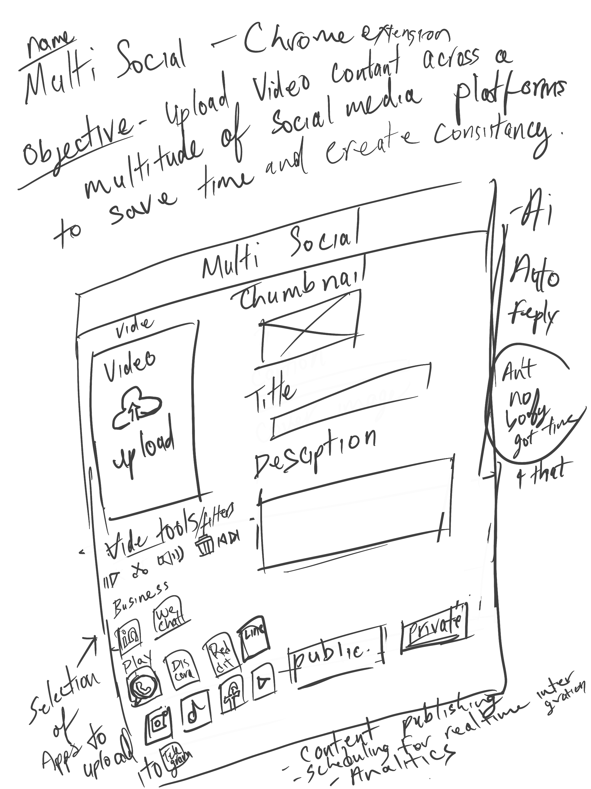
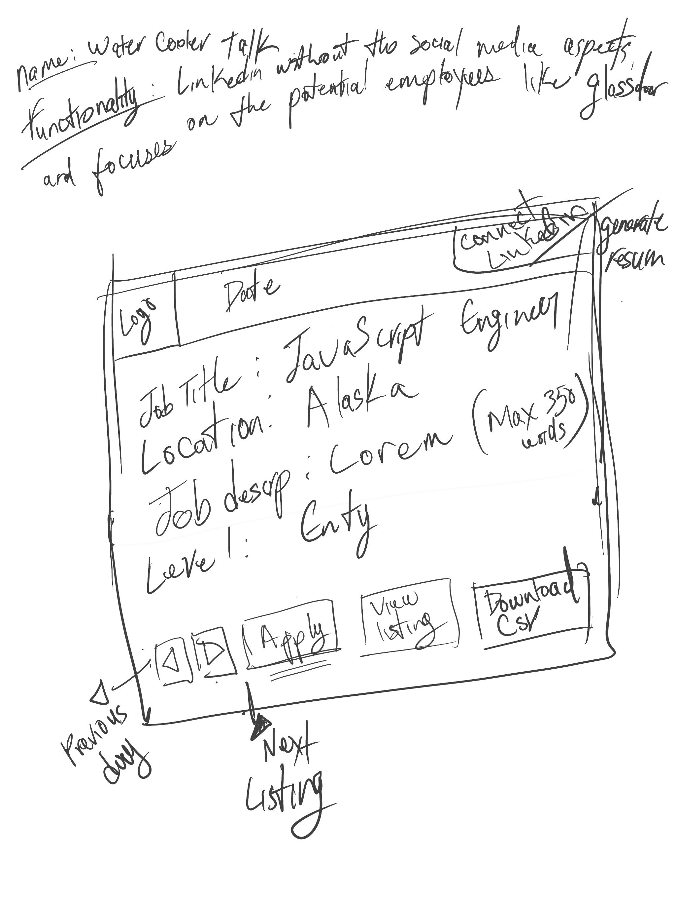

<ins>Questions to ask myself:</ins>
- What problem am I solving?
- Is it legal?
- How to MONETIZE it?
- Is it doable?
  -  if not, what  do I have to learn?
- Ownership?
- User Access?
- Target audience?
- Competition?
  

<ins>Application Ideas:</ins>
  - SaaS
    - Social Media:
      - NANME: Social Corner - Standard social Media App
      - NANME: Multi-Social (extension) - Social Media Consolidation and management tool / Application
      
        

    - Job / Career Forum (extension):
      - NAME: Water Cooler Talk - Linkedin without the social media aspects, and focuses on the potential employees like Glassdoor.
        - MAIN KEY Feature: Pulls in 1 job a day for you to apply to rather than you searching and applying to MANY jobs from various jobboards. Therefore preventing fatigue / burnout caused by job searching.
        - Autolocates a minimum of 1 job for you to apply to for a day
        - auto populates job form details
        - Uses ai to auto-generate custom
        - How to monetize?
    
      

<ins>Free Application:</ins>
- NANME: Genki 100 - Healthcare application for locating free to low-cost healthcare providers near you.
  

<ins>Platform:</ins>
- Chrome Extension
- Web Application
- Mobile